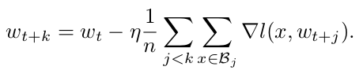
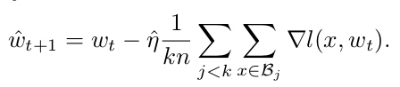
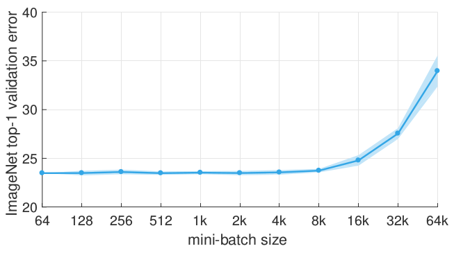

## Accurate, Large Minibatch SGD
## Training ImageNet in 1 Hour

---

### Main Idea
- Higher training speed requires larger mini-batch size.

> 8192 images one batch, 256 GPUs

- Larger mini-batch size leads to lower accuracy
- Linear scaling rule for adjusting learning rates as a function of minibatch size
- Warmup scheme overcomes optimization challenges early in training

---

### Background
- mini-batch SGD
- Larger mini-batch size lead to lower accuracy.

---

---
### mini-batch SGD
- Iteration(in FaceBook Paper):

- Convergence:
  - Learning Rate: 
  - Converge Speed: 

  >  M: batch size, K: iteration number, σ²:  stochastic gradient variance

---

### Goal
- Use large minibatches
  - scale to multiple workers
- Maintaining training and generalization accuracy

---

### Solution
- Linear Scaling Rule: When the minibatch size is multiplied by k, multiply the learning rate by k.

---

### Analysis
- k iteration, minibatch size of n:

- 1 iteration, minibatch size of kn:

- Assume gradients of the above fomulas are equal
  - Two updates can be similar only if we set the second learning rate to k times the first learning rate.

---

### When assumptions not hold
- Initial training epochs when the network is changing rapidly.
- Results are stable for a large range of sizes, beyond a certain point

---

### Warm Up
- Low learning rate to solve rapid change of the initial network.
- Constant Warmup: Sudden change of learning rate causes the training error to spike.
- Gradual warmup: Ramping up the learning rate from a small to a large value.
- start from a learning rate of η and increment it by a constant amount at each iteration such that it reaches η'= kη after 5 epochs.

---

---

### Subtleties and Pitfalls of Distributed SGD
- Weight decay: Scaling the cross-entropy loss is not equivalent to scaling the learning rate.
- Momentum correction: Apply momentum correction after changing learning rate.
- Gradient aggregation: Normalize the per-worker loss by total minibatch size kn, not per-worker size n.
- Data shuffling: Use a single random shuffling of the training data (per epoch) that is divided amongst all k workers.

---

### Weight decay

- Loss containing weight decay term: 

- Update: 
- Scaling the cross-entropy loss is not equivalent to scaling the learning rate.
---
### Momentum correction
- Original momentum:

- A popular variant absorbs the learning rate into the update tensor.

- When η changes, to maintain equivalence, v should be:

---
### Experiment
- Dataset: ImageNet
- Hardware: 256 NVIDIA Tesla P100 GPUs
- Software: Caffe2
- Network: ResNet-50
- Batch size: 8192 images.
---

---

> Distributed synchronous SGD timing
---

> Distributed synchronous SGD throughput
---
### Reference
- [Accurate, Large Minibatch SGD: Training ImageNet in 1 Hour](https://research.fb.com/wp-content/uploads/2017/06/imagenet1kin1h3.pdf?)
- [机器之心提问：如何评价Facebook Training ImageNet in 1 Hour这篇论文?](https://www.zhihu.com/question/60874090)
- [Asynchronous Parallel Stochastic Gradient for Nonconvex Optimization](https://arxiv.org/abs/1506.08272)
- [ENTROPY-SGD: BIASING GRADIENT DESCENT INTO WIDE VALLEYS](https://arxiv.org/pdf/1611.01838.pdf)
